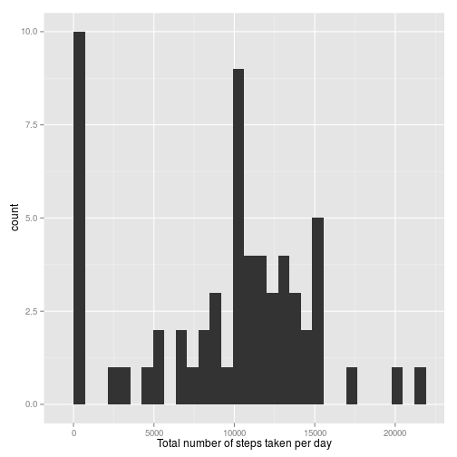

# Reproducible Research: Peer Assessment 1


## Loading and preprocessing the data
First, we will load the data by reading from the data source - a csv file stored in a zip file.

```r
data <- read.csv(unz("activity.zip", "activity.csv"), header=T, quote="\"", 
                 sep=",",colClasses=c("numeric","factor","numeric"))
```

## What is mean total number of steps taken per day?
To answer this question we will plot a histogramm showing the mean total number of steps taken per day.

```r
tot_steps_day <- setNames(aggregate(data$steps, by=list(data$date), FUN=sum,na.rm=TRUE),
                          c("Day","Steps"))
```

```r
library("ggplot2")
ggplot(tot_steps_day, aes(x=Steps)) + geom_histogram(binwidth = diff(range(tot_steps_day$Steps))/30) + xlab("Total number of steps taken per day") 
```

 

Next, we will calculate and report the mean and median total number of steps taken per day.

```r
meanmedian <- c(mean(data$steps,na.rm=TRUE),median(data$steps,na.rm = TRUE))
mmdf <- setNames(data.frame(meanmedian[1],meanmedian[2]),c("Mean","Median")) ##Transform to Data Frame for kable
```

```r
kable(mmdf, digits=2)
```


|  Mean| Median|
|-----:|------:|
| 37.38|      0|
## What is the average daily activity pattern?


## Imputing missing values


## Are there differences in activity patterns between weekdays and weekends?
