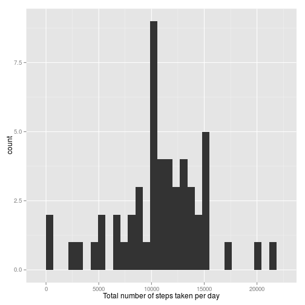

# Reproducible Research: Peer Assessment 1


## Loading and preprocessing the data
First, we will load the data by reading from the data source - a csv file stored in a zip file.

```r
data <- read.csv(unz("activity.zip", "activity.csv"), header=T, quote="\"", 
                 sep=",",colClasses=c("numeric","factor","numeric"))
```

## What is mean total number of steps taken per day?
To answer this question we will first plot a histogramm showing the total number of steps taken per day.

```r
tot_steps_day <- setNames(aggregate(data$steps[!is.na(data$steps)], by=list(data$date[!is.na(data$steps)]), FUN=sum), c("Day","Total_Steps"))

library("ggplot2")
ggplot(tot_steps_day, aes(x=Total_Steps)) + geom_histogram(binwidth = diff(range(tot_steps_day$Total_Steps))/30) + xlab("Total number of steps taken per day") 
```

 

Next, we will calculate and report the mean and median total number of steps taken per day.


```r
meanmedian <- c(mean(tot_steps_day$Total_Steps,na.rm=TRUE),median(tot_steps_day$Total_Steps,na.rm = TRUE))

mmdf <- setNames(data.frame(meanmedian[1],meanmedian[2]),c("Mean","Median")) ##Transform to Data Frame for kable
```

```r
kable(mmdf, digits=2)
```


|  Mean| Median|
|-----:|------:|
| 10766|  10765|
## What is the average daily activity pattern?
In this section we want to analyze the activity pattern for each interval during the day. To do so, we will draw a line graph showing the average number of steps for each intervall. Also, we will highlight the maximum in the graph and label it with the respective data point.

```r
daily_act_pat_week <- setNames(aggregate(data$steps, by=list(data$interval), FUN=mean,na.rm=TRUE), c("Interval","Mean_Steps"))

maximum <- setNames(c(daily_act_pat_week$Interval[daily_act_pat_week$Mean_Steps==max(daily_act_pat_week$Mean_Steps)],max(daily_act_pat_week$Mean_Steps)), c("Interval","Maximum_Steps"))

ggplot(data=daily_act_pat_week, aes(x=Interval, y=Mean_Steps)) + geom_line() + geom_point(data=daily_act_pat_week[daily_act_pat_week$Interval==835,], aes(x=Interval, y=Mean_Steps), colour="red", size=5) + geom_text(data = NULL, x = maximum[1]+470,y = maximum[2], aes(label = paste("Maximum  (",as.character(round(maximum[1],1))," / ",as.character(round(maximum[2],1)), ")",sep="")), parse = TRUE) + ylab("Number of steps")
```

 

## Imputing missing values
To know about the impact of missing values we will first calculate the total number of rows with NAs.

```r
print(paste("Total number of rows with NAs: ",sum(!complete.cases(data)),sep=""))
```

```
## [1] "Total number of rows with NAs: 2304"
```

Now we create a new dataset that is equal to the original dataset but we will replace the missing values for the steps with the average total number of steps in the corresponding interval.


```r
data_completed <- data
for (i in 1:nrow(data_completed))
  if (is.na(data_completed$steps[i])) data_completed$steps[i] <- round(daily_act_pat_week$Mean_Steps[daily_act_pat_week$Interval==data_completed$interval[i]],0)
```

As for the original data set, again we will plot a histogram and calculate the mean and the median.


```r
tot_steps_day_comp <- setNames(aggregate(data_completed$steps, by=list(data_completed$date), FUN=sum), c("Day","Total_Steps"))
ggplot(tot_steps_day_comp, aes(x=Total_Steps)) + geom_histogram(binwidth = diff(range(tot_steps_day_comp$Total_Steps))/30) + xlab("Total number of steps taken per day") 
```

 


```r
meanmedian_comp <- c(mean(tot_steps_day_comp$Total_Steps),median(tot_steps_day_comp$Total_Steps))
mmdf_comp <- setNames(data.frame(meanmedian_comp[1],meanmedian_comp[2]),c("Mean","Median")) ##Transform to Data Frame for kable
```

```r
kable(mmdf_comp, digits=2)
```


|  Mean| Median|
|-----:|------:|
| 10766|  10762|

As we can see compared to the histogram of the original data set we have now some additional data points near the mean. This is as expected as we replaced the missing values with the mean for the corresponding interval. Whereas the mean stays the same as for the original dataset, the median has slightly changed.
## Are there differences in activity patterns between weekdays and weekends?
Last but not least, we want to have a look at differences between the activity patterns for weekdays and the weekend.

```r
library("chron")
for (i in 1:nrow(data_completed)) {data_completed$weekend[i] <- if (is.weekend(data_completed$date[i])) "weekend" else "weekday"}
```

```r
  daily_act_pat_week <- setNames(aggregate(data_completed$steps, by=list(data_completed$weekend,data_completed$interval), FUN=mean),  c("Weekend","Interval","Mean_Steps"))
ggplot(data=daily_act_pat_week, aes(x=Interval, y=Mean_Steps)) + geom_line()  + facet_grid( Weekend ~ . ) + ylab("Number of steps")
```

 
